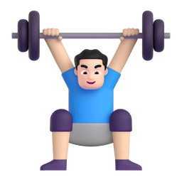
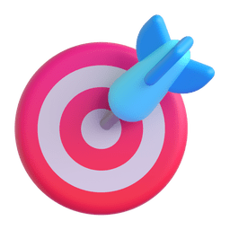
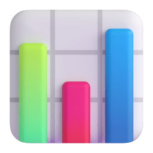
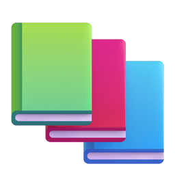

<h1 align="center">
¡Buenas! Soy Javier 
</h1>

##  Mis principales habilidades y aptitudes

##  Competencias que entreno

  
  Mis proyectos personales 

- [ ] Completar todos los retos de [frontendmentor.io](https://www.frontendmentor.io/challenges)
- [ ] Rehacer el proyecto [una-galeria-mas](https://github.com/javiluli/una-galeria-mas)
- [ ] Rehacer el programa de [java-array-sort-visualizer](https://github.com/javiluli/java-array-sort-visualizer)
- [ ] Customizar el CSS de mi perfil de [CodePen](https://codepen.io/javiluli_dev)
- [ ] Rehacer mi [CV web](https://javiluli.github.io/my-online-cv/) como porfolio con `Astro`.
- [ ] Crear un Bot con `Discord.js`.
- [ ] Crear una aplicación que utilice [Socket.IO](https://socket.io/)

<table width="960px">
<tr>
<td valign="top" width="50%">
<h2>  Mis estadísticas en GitHub </h2>

<picture>
<source media="(prefers-color-scheme: dark)" srcset="https://github.com/javiluli/javiluli/blob/master/images/wakatime_weekly_language_stats_black.svg">
<source media="(prefers-color-scheme: light)" srcset="https://github.com/javiluli/javiluli/blob/master/images/wakatime_weekly_language_stats.svg">

</picture>

<h2>  Mis ultimos repositorios </h2>

</td>
<td valign="top" width="50%">

<h2>
   Un meme al día de Reddit
</h2>

hector-the-dragon<i> - Beep Boop, did you just touch me multiple times?</i> - 

</td>
</tr> 
</table>

<picture>

</picture>

<h2>
 Donde encontrarme
</h2>

 

------------

 ¡Este archivo <i>README</i> se genera <b>cada día!</b>   Última actualización: Domingo, 22 de diciembre, 02:00 CET 

   

