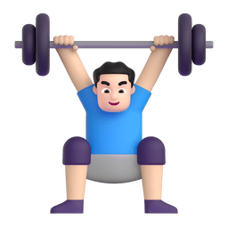
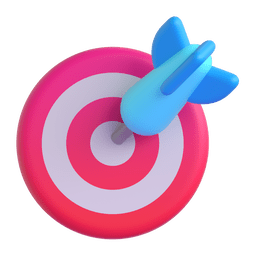
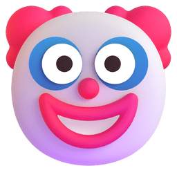

<h1 align="center">
  ¡Buenas! Soy Javier 
</h1>

<!-- redes sociales -->

##  Mis principales habilidades y aptitudes 

###  Competencias que entreno 

  
  Mis proyectos personales  

- [ ] Completar todos los retos de [frontendmentor.io](https://www.frontendmentor.io/challenges)
- [ ] Rehacer el proyecto [una-galeria-mas](https://github.com/javiluli/una-galeria-mas) [:page_facing_up:](./details.md#01)
- [ ] Rehacer el programa de [java-array-sort-visualizer](https://github.com/javiluli/java-array-sort-visualizer)
- [ ] Customizar el CSS de mi perfil de [CodePen](https://codepen.io/javiluli_dev)
- [ ] Rehacer mi [CV web](https://javiluli.github.io/my-online-cv/) como porfolio con `Astro`.
- [ ] Crear un Bot con `Discord.js`.
- [ ] Crear una aplicación que utilice [Socket.IO](https://socket.io/)

##  Mis estadísticas en GitHub

<table width="960px">
<tr>
<td valign="top" width="50%">
<picture>
<source media="(prefers-color-scheme: dark)" srcset="https://github.com/javiluli/javiluli/blob/master/images/wakatime_weekly_language_stats_black.svg">
<source media="(prefers-color-scheme: light)" srcset="https://github.com/javiluli/javiluli/blob/master/images/wakatime_weekly_language_stats.svg">

</picture>
</td>

<td valign="top" width="50%">

####  Meme del día

<picture>

</picture>
</td>
</tr>
</table>

<picture>

</picture>

 

##  Mis ultimos repositorios

