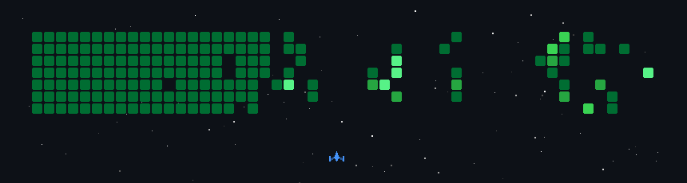

# ¡Buenas! Soy Javier 👋

Desarrollo proyectos para aprender, resolver problemas y compartir herramientas útiles. Me interesan el desarrollo web, Java y crear utilidades para videojuegos.

---

## 🚀 Proyectos destacados

### [Create: Pipe Connector](https://github.com/javiluli/Create-Pipe-connector)

Complemento para Minecraft Create que permite planificar, previsualizar y colocar rutas de tuberías, con anclajes y opciones de construcción. Disponible para Forge y NeoForge.

**Tecnologías:** Java · Minecraft · Forge / NeoForge  
[Repositorio](https://github.com/javiluli/Create-Pipe-connector) · [CurseForge](https://www.curseforge.com/minecraft/mc-mods/create-pipe-connector) · [Modrinth](https://modrinth.com/mod/create-pipe-connector)

### [StarRupture Planner](https://github.com/javiluli/starrupture-planner)

Planificador de producción para calcular máquinas, recursos y líneas de suministro, con un mapa visual de los flujos y métricas de energía y calor.

**Tecnologías:** React · TypeScript · Vite · React Flow  
[Repositorio](https://github.com/javiluli/starrupture-planner)

📚 Más repositorios actualizados recientemente

- [starrupture-planner](https://github.com/javiluli/starrupture-planner)
- [InstantXP](https://github.com/javiluli/InstantXP)
- [Create-Pipe-connector](https://github.com/javiluli/Create-Pipe-connector)
- [Extended-Beacon-Range](https://github.com/javiluli/Extended-Beacon-Range)
- [react-component-display](https://github.com/javiluli/react-component-display)
- [reddit-rplace-clone](https://github.com/javiluli/reddit-rplace-clone)
- [resolved-frontendmentor-challenges](https://github.com/javiluli/resolved-frontendmentor-challenges)
- [array-sort-visualizer-V2](https://github.com/javiluli/array-sort-visualizer-V2)

[Ver todos mis repositorios](https://github.com/javiluli?tab=repositories)

## 🛠️ Tecnologías y herramientas

         

Otras herramientas que estoy explorando

   

## 📊 Actividad de desarrollo

Estadísticas semanales de lenguajes registradas por WakaTime (reflejan tiempo registrado, no dominio de cada tecnología).

<picture>
  <source media="(prefers-color-scheme: dark)" srcset="./images/wakatime_weekly_language_stats_black.svg" />
  <source media="(prefers-color-scheme: light)" srcset="./images/wakatime_weekly_language_stats.svg" />
  
</picture>

## 🎮 Un rincón más personal

👾 Mi juego de contribuciones de GitHub

😄 Un meme diario de Reddit

Compartido por Until_I_Collapse en Reddit · Respectfully, shut up

---

**📬 También puedes encontrarme en** [CodePen](https://codepen.io/javiluli_dev) · [LinkedIn](https://www.linkedin.com/in/javier-delgado-rodriguez-165910331) · [Discord](https://discord.gg/YCfxzd6krh).

README generado automáticamente · Última actualización: Miércoles, 16 de septiembre, 12:18 CEST - Día de la Independencia de México 🇲🇽🎉

